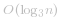

## 二分

往常我们使用「二分」进行查值，需要确保序列本身满足「二段性」：当选定一个端点（基准值）后，结合「一段满足 & 另一段不满足」的特性来实现“折半”的查找效果。

但本题求的是峰顶索引值，如果我们选定数组头部或者尾部元素，其实无法根据大小关系“直接”将数组分成两段。

但可以利用题目发现如下性质：**由于 `arr` 数值各不相同，因此峰顶元素左侧必然满足严格单调递增，峰顶元素右侧必然不满足。**

因此 **以峰顶元素为分割点的 `arr` 数组，根据与 前一元素/后一元素 的大小关系，具有二段性：**

* 峰顶元素左侧满足 *arr[i-1] < arr[i]* 性质，右侧不满足
* 峰顶元素右侧满足 *arr[i] > arr[i+1]* 性质，左侧不满足

因此我们可以选择任意条件，写出若干「二分」版本。

代码：
```Java []
class  {
    // 根据 arr[i-1] < arr[i] 在 [1,n-1] 范围内找值
    // 峰顶元素为符合条件的最靠近中心的元素
    public int peakIndexInMountainArray(int[] arr) {
        int n = arr.length;
        int l = 1, r = n - 1;
        while (l < r) {
            int mid = l + r + 1 >> 1;
            if (arr[mid - 1] < arr[mid]) {
                l = mid;
            } else {
                r = mid - 1;
            }
        }
        return r;
    }
}
```
```Java []
class Solution {
    // 根据 arr[i] > arr[i+1] 在 [0,n-2] 范围内找值
    // 峰顶元素为符合条件的最靠近中心的元素值
    public int peakIndexInMountainArray(int[] arr) {
        int n = arr.length;
        int l = 0, r = n - 2;
        while (l < r) {
            int mid = l + r >> 1;
            if (arr[mid] > arr[mid + 1]) {
                r = mid;
            } else {
                l = mid + 1;
            }
        }
        return r;
    }
}
```
```Java []
class Solution {
    // 根据 arr[i-1] > arr[i] 在 [1,n-1] 范围内找值
    // 峰顶元素为符合条件的最靠近中心的元素的前一个值
    public int peakIndexInMountainArray(int[] arr) {
        int n = arr.length;
        int l = 1, r = n - 1;
        while (l < r) {
            int mid = l + r >> 1;
            if (arr[mid - 1] > arr[mid]) {
                r = mid;
            } else {
                l = mid + 1;
            }
        }
        return r - 1;
    }
}
```
```Java []
class Solution {
    // 根据 arr[i] < arr[i+1] 在 [0,n-2] 范围内找值
    // 峰顶元素为符合条件的最靠近中心的元素的下一个值
    public int peakIndexInMountainArray(int[] arr) {
        int n = arr.length;
        int l = 0, r = n - 2;
        while (l < r) {
            int mid = l + r + 1 >> 1;
            if (arr[mid] < arr[mid + 1]) {
                l = mid;
            } else {
                r = mid - 1;
            }
        }
        return r + 1;
    }
}
```
* 时间复杂度： 
* 空间复杂度：*O(1)*

---

## 三分

事实上，我们还可以利用「三分」来解决这个问题。

顾名思义，**「三分」就是使用两个端点将区间分成三份，然后通过每次否决三分之一的区间来逼近目标值。**

具体的，由于峰顶元素为全局最大值，因此我们可以每次将当前区间分为 *[l, m1]*、*[m1, m2]* 和 *[m2, r]* 三段，如果满足 *arr[m1] > arr[m2]*，说明峰顶元素不可能存在与 *[m2, r]* 中，让 *r = m2 - 1* 即可。另外一个区间分析同理。

代码：
```Java []
class Solution {
    public int peakIndexInMountainArray(int[] arr) {
        int n = arr.length;
        int l = 0, r = n - 1;
        while (l < r) {
            int m1 = l + (r - l) / 3;
            int m2 = r - (r - l) / 3;
            if (arr[m1] > arr[m2]) {
                r = m2 - 1;
            } else {
                l = m1 + 1;
            }
        }
        return r;
    }
}
```
* 时间复杂度： 
* 空间复杂度：*O(1)*

---

## 其他「二分」相关题解

* 二分模板
    [29. 两数相除](https://leetcode-cn.com/problems/divide-two-integers/) : [二分 + 倍增乘法解法（含模板）](https://leetcode-cn.com/problems/divide-two-integers/solution/shua-chuan-lc-er-fen-bei-zeng-cheng-fa-j-m73b/)

* 二分模板题
    [278. 第一个错误的版本](https://leetcode-cn.com/problems/first-bad-version/) : [使用交互函数充当 check 进行二分](https://leetcode-cn.com/problems/first-bad-version/solution/gong-shui-san-xie-shi-yong-jiao-hu-han-s-8hpv/)

    [374. 猜数字大小](https://leetcode-cn.com/problems/guess-number-higher-or-lower/) : [使用交互函数充当 check 进行二分](https://leetcode-cn.com/problems/guess-number-higher-or-lower/solution/gong-shui-san-xie-shi-yong-jiao-hu-han-s-tocm/)

    [852. 山脉数组的峰顶索引](https://leetcode-cn.com/problems/peak-index-in-a-mountain-array/) : [二分 & 三分查值问题](https://leetcode-cn.com/problems/peak-index-in-a-mountain-array/solution/gong-shui-san-xie-er-fen-san-fen-cha-zhi-5gfv/)

* 二分本质 & 恢复二段性处理
    [33. 搜索旋转排序数组（找目标值）](https://leetcode-cn.com/problems/search-in-rotated-sorted-array/) : [严格 O(logN)，一起看清二分的本质](https://leetcode-cn.com/problems/search-in-rotated-sorted-array/solution/shua-chuan-lc-yan-ge-ologn100yi-qi-kan-q-xifo/)

    [81. 搜索旋转排序数组 II（找目标值）](https://leetcode-cn.com/problems/search-in-rotated-sorted-array-ii/) : [详解为何元素相同会导致 O(n)，一起看清二分的本质](https://leetcode-cn.com/problems/search-in-rotated-sorted-array-ii/solution/gong-shui-san-xie-xiang-jie-wei-he-yuan-xtam4/)

    [153. 寻找旋转排序数组中的最小值（找最小值）](https://leetcode-cn.com/problems/find-minimum-in-rotated-sorted-array/) : [严格 O(logN)，一起看清二分的本质](https://leetcode-cn.com/problems/find-minimum-in-rotated-sorted-array/solution/gong-shui-san-xie-yan-ge-olognyi-qi-kan-6d969/)

    [154. 寻找旋转排序数组中的最小值 II（找最小值）](https://leetcode-cn.com/problems/find-minimum-in-rotated-sorted-array-ii/) : [详解为何元素相同会导致 O(n)，一起看清二分的本质](https://leetcode-cn.com/problems/find-minimum-in-rotated-sorted-array-ii/solution/gong-shui-san-xie-xiang-jie-wei-he-yuan-7xbty/)

* 二分 check 函数如何确定
    [34. 在排序数组中查找元素的第一个和最后一个位置](https://leetcode-cn.com/problems/find-first-and-last-position-of-element-in-sorted-array/) : [考察对「二分」的理解，以及 check 函数的「大于 小于」怎么写](https://leetcode-cn.com/problems/find-first-and-last-position-of-element-in-sorted-array/solution/gong-shui-san-xie-kao-cha-dui-er-fen-de-86bk0/)